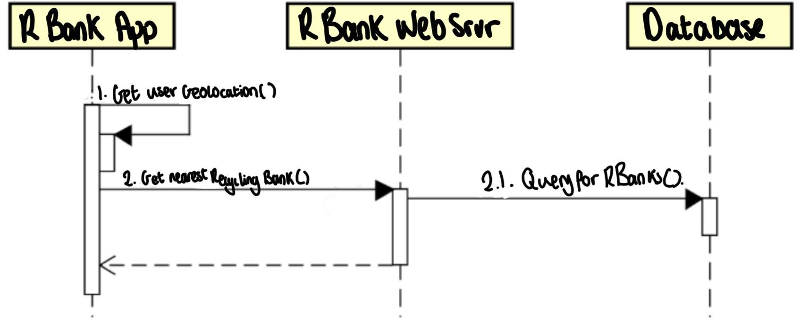
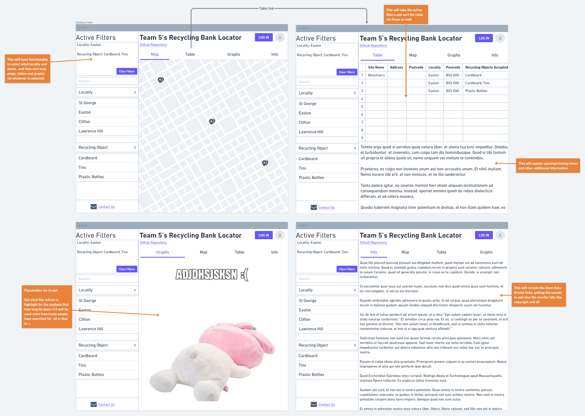

# Design

## Behavioural design

### UC1 Scenario
- UC1 is for people who want to recycle so if they would like to recycle for example, glass, they can use our website and search for a bank that allows for glass to be recycled. It will allow for a search of certain things that want to be recycled like plastics, cardboard and much more. Technically, it will take a checklist reading and form an SQL reading. It will then interact with the web server and pull our dataset and then sort it within the parameters the user has set via the checklist.

### UC2 Scenario
- UC2 is for the companies and the maintainers that want to keep their service running. It will run the same way however, the usage of the logins when connecting to the webserver may be present here so the Companies and the Maintainers can see if the data is correct and then request to change if needed.

## User Interface design

