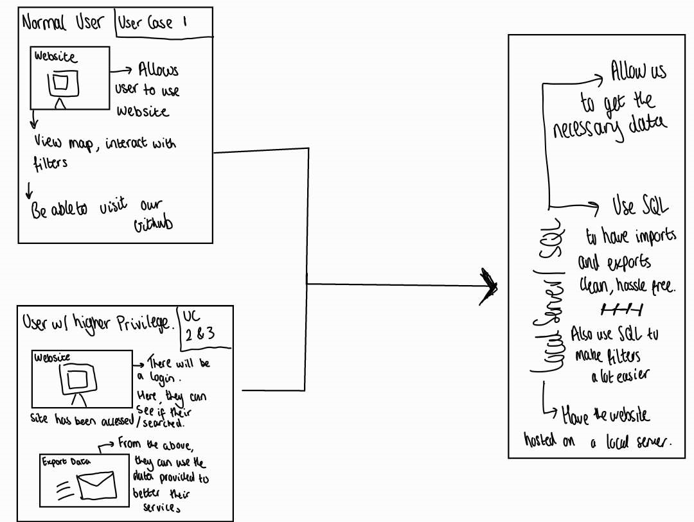

# Implementation

## Introduction
TODO: Describe the system implemented (Describe the dataset. Are there any known issues? Describe any configuration data).

### What is this Dataset?
- This Dataset is to locate recycling banks across Bristol and the surrounding Area. The Dataset consists of the IDs, Addresses, What can be recycled and more.
- The reason why we chose this Dataset was that as a group (more like a duo) we believed that Bristol is an environmentally healthy city and wanting to push that agenda even more we thought we should help the public recycle more.

### Was there any Config Data
- Yes on the Dataset itself, there were code annotations when we exported it to help with any issues importing and exporting (of course it didn't help).
- We also set up versioning between out two logins so one would have one more updated and one would have the previous to see if any changes were made and how we can make other significant changes without layering them. This was locally documented through text.

### Issues within the Dataset
- With the Recycling Banks dataset, there was an issue to begin with right off the bat. We had to import the .csv file in another format as there was too much data for SQL Workbench to handle but that was fixed within Workbench. 
- Another issue that arose was the ObjectID column was named incorrectly with it being called !?ObjecTiD?! I had a feeling that this was due to the problems we had while it was trying to be imported. We used SQL to 'REPLACE' that column name and the rest worked well.
- Our Data also had a lot of empty cells and columns which is why it may have been too big in the first place so we had to remove and also put recurring data in as the values are needed for the data to display correctly.
- Sometimes the dataset would also show incorrect but it was to do with SQL Workbench.

## Project Structure
TODO: Provide an outline of the project folder structure and the role of each file within it (not the contents of node_modules).
provide a table listing the number of jslint warnings/reports for each module.

- Package.json just repeats what our title is and what version we are at with the packaging.
- Landing.js is our home page for the website with a welcome and everything.
- LoginAPI.js is out login API that utilises my own laptop as a server and sends a POST request. When the user clicks on the login button, it encodes the Username and Password into the body that gets sent to the server. When the request reaches the server, it sends the JSON data only. The rest of the API is more client side based. Errors that accured were getting connected to the server and also 

## Software Architecture

- Our major components were having to types of user, one with normal accesss **(UC1)**, another with elevated access which meant that there was a login system **(UC2 AND 3)**. As you can see in the diagram below, they also have different things that can be done with the website.
- Another component that is there is to host a local server on an older laptop or tablet which shouldn't be under too much stress, so we can keep it running for about a week straight no issues. From that we would collect data and return it to the **UC2 AND 3** Users.
- One Architectural style I can think of that this resembles is Application Architecture. Splitting up your users and having distinct features for each.

## Diagram 

