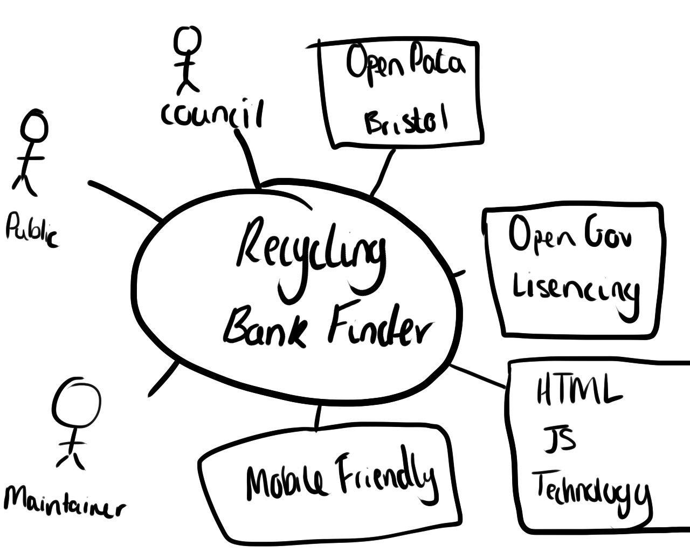

# Project Proposal

## Business Case

### Problem statement
Bristol City Council allow for open data to be accessed relating to placement of **Recycling Banks**. We will be using this open data to allow for the public to locate the closest Recycling Banks given certan criteria.

### Business benefits
Businesses, as well as consumers frequenting businesses, would see many positive benefits from their ability to easily and swiftly examine recyling bank data. These benefits comprise:
- Increased efficiency in location of recycling banks according to the specific criteria of end users.
- Businesses without recycling facilities can examine the need for recycling banks and objectively observe data relating to the number persons recycling in their area.
- Can create traffic towards local business and enable consumers to streamline their waste disposal in an ethically conscious fashion, i.e: recycling waste conveniently before shopping.

### Options Considered:
Without knowledge of the nearest civic amenity site, end users are left at a loss and may turn to inferior and/or inefficient waste disposal alternatives. They may wait for weekly bin collection from the Council. They may end up using normal bins the contents of which aren't recycling - which is worse for the environment. They may even turn to littering. One may attempt to find a solution using Google and Apple Maps, but there is rarely sufficient information on these apps to make such decisions.

### Expected Risks:
There are also multiple caveats to our implementation of this service:
- It is important to consider than it will be an inevitable waste of resources with respect to those certain people who won't use it.
- The data set may not be kept updated/will require maintenance to remain accurate. If a bin is out of order, for example, the data will need to change.
- If the bins themselves are not cleaned and cleared properly they could risk suffering infestation.
- Appropriately trained persons may be scarce; misuse of bins could be a possibility, items wrongly disposed of.

## Project Scope:
Our Project scope consists of the people using the website and whatwe will use to develop it.

Actors:

- NPCs, Council / Recycling / Eco-Friendly Publics

Systems: 
- Open Data -> The source of our data
- Database (Backend) - To present even more data perhaps? To track changes and cross reference status of bins (maybe?) //**nonessential**
- Map Integration / Google Maps - Allows for a more user friendly experience //**nonessential**
- HTML / NodeJS - What we will be using to code up and export import etc.
- Drawings to clarify - Diagrams and drawings to clarify and streamline our direction with respect to development plan

